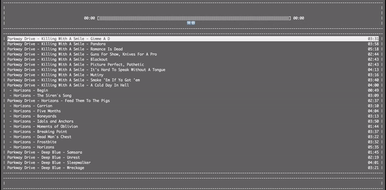

Simple Swift NCurses player made for fun.

## Usage
`curse_music [path]`

CurseMusic recursively searches path for songs is provided. If not, CurseMusic loads last state stored in `~/.curse_music`

## Controls
- `q` - quit
- `j` - navigate down
- `k` - navigate up
- `Enter` - play selected song
- `p` - play / pause
- `s` - shuffle on / off
- `r` - repeat on / off
- `n` - next song
- `/` - starts interactive fuzzy search, `Enter` to finish
- `^l` - clear search
